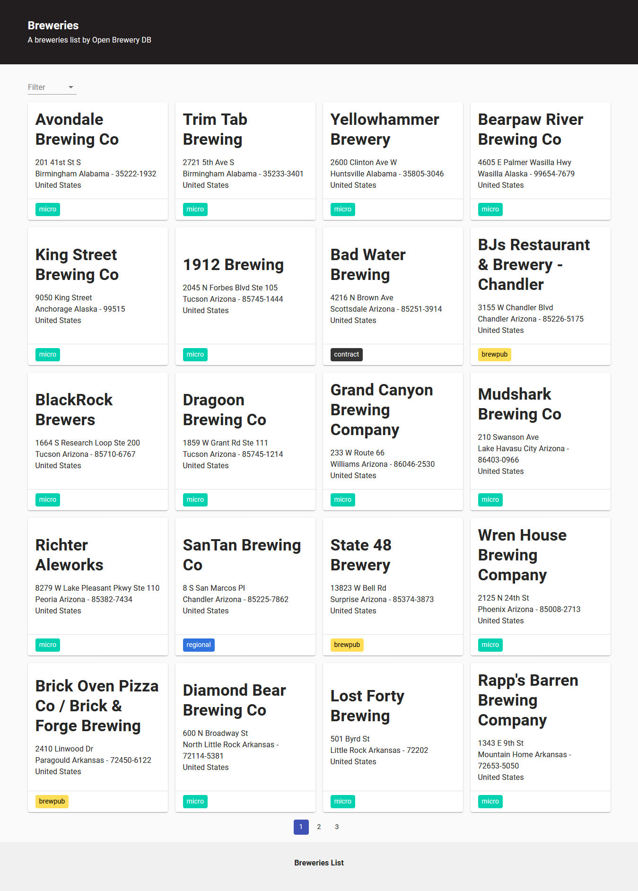
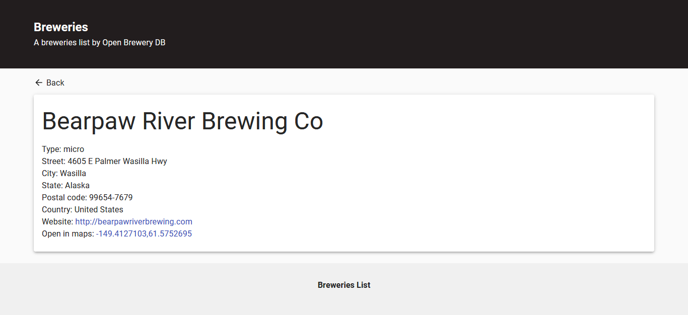

# Teste da Linx

Fiz este no projeto no intuito de praticar e aprender as tecnologias que usei para desenvolve-lo.

O projeto foi baseado em um teste para desenvolvedores front-end, feito pela empresa [Linx](https://www.linx.com.br/).

Encontrei o teste no repositório [frontend-challenges](https://github.com/felipefialho/frontend-challenges), criado pelo [Felipe Fialho](https://github.com/felipefialho).

[Link para o repositório do teste](https://github.com/chaordic/desafio-frontend).

### Tecnologias utilizadas

- [ReactJS](https://pt-br.reactjs.org/)
- [Typescript](https://www.typescriptlang.org/)
- [Material UI](https://material-ui.com/pt/)
- [Jest](https://jestjs.io/)
- [React Testing Library](https://testing-library.com/docs/react-testing-library/intro/)

## Sobre

O teste consiste em, construir uma aplicação que faz uma listagem de cervejarias com base nos dados retornados da [Open Brewery DB](https://www.openbrewerydb.org/) que é uma [API](https://api.openbrewerydb.org/breweries) de cervejarias. Podendo, filtrar as cervejarias por tipo, paginar pelas três primeiras páginas da listagem e ver dados de uma cervejaria.

## UI

### [Tela 1](./ui/home-desktop.png)

- Listar as cervejarias.
- Permitir paginação das 3 primeiras páginas de listagem.
- Permitir filtro de cervejarias por tipo.

<div align="center" >
 
</div>

### [Tela 2](./ui/details-desktop.png)

- Exibir dados de uma cervejaria.

- Permitir abrir o Google Maps com a localização da cervejaria.

<div align="center" >
 
</div>

## Como usar

Após clonar o repósitorio, instale as dependências.

```bash
  $ yarn install
  # ou
  $ npm install
```

Após finalizar a instalação das dependências, utilize um dos comandos abaixo:

- `start`: sobe à aplicação em modo desenvolvimento de em `localhost:3000`

- `test`: executa todos os testes

- `test:coverage`: executa todos os testes e exibi à porcentagem de cobertura dos testes
